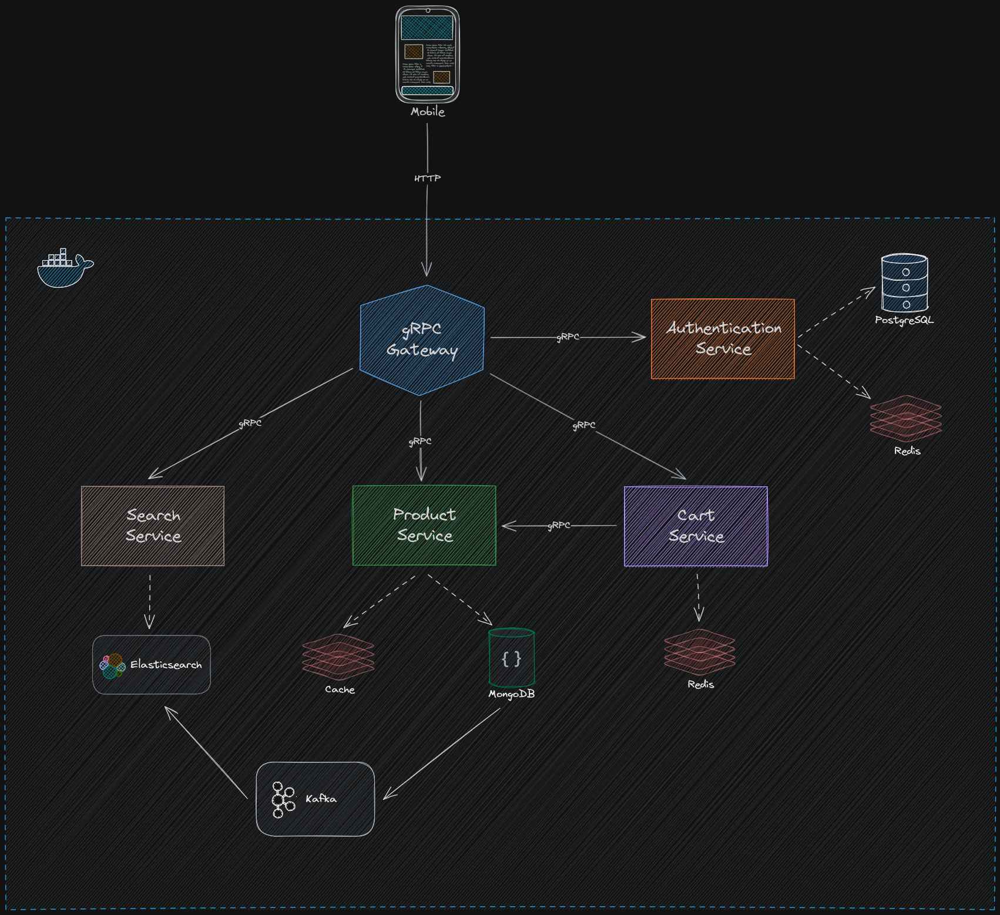

# Tech Shop - Backend

Tech Shop is a robust and scalable e-commerce platform built with a microservices architecture. It leverages the power of gRPC for efficient, high-performance communication between services.

This project demonstrates the practical application of microservices in developing a comprehensive e-commerce platform. Each microservice is responsible for a specific functionality, ensuring a high degree of modularity and scalability.

Stay tuned for more features and improvements as we continue to expand and refine Tech Shop.

## Software Architechture



## Run Locally with Docker

Clone the project

```bash
  git clone https://github.com/YungBenn/tech-shop-microservices.git
```

Go to the project directory

```bash
  cd tech-shop-microservices
```

create .env from example

```bash
  cp .env.example .env
```

Start the server with make

```bash
  make docker.up
```

## Features

-   a
-   b
-   c
-   d
